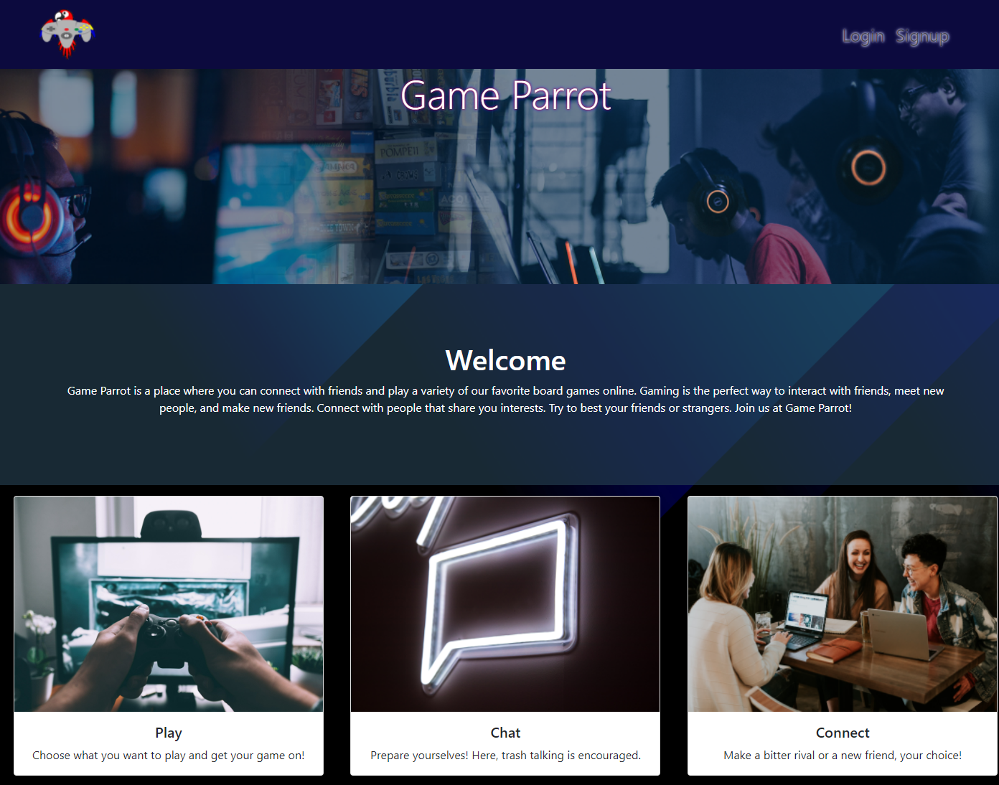
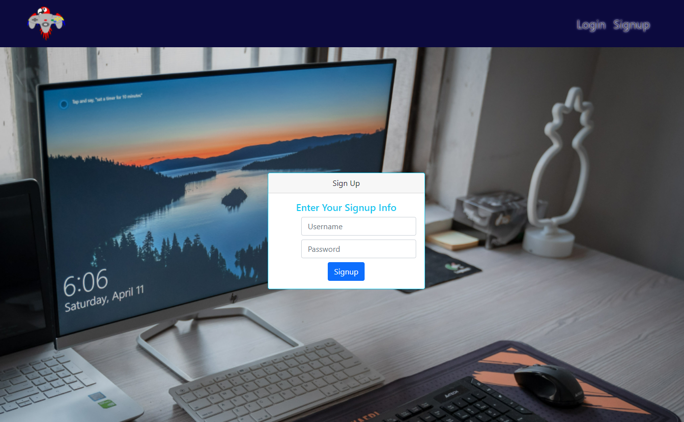
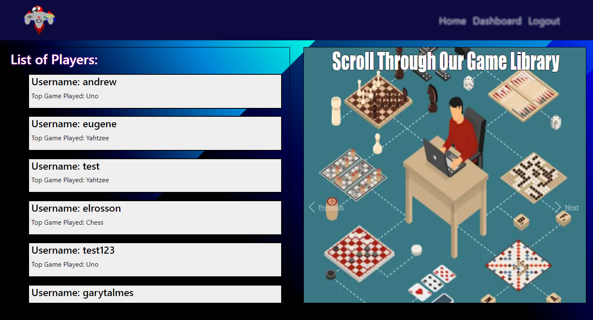
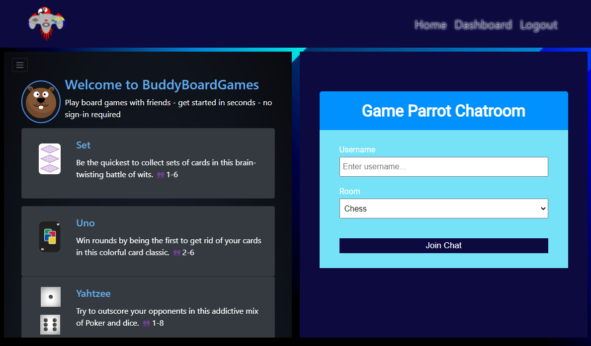

# Game Parrot

## Description

The purpose of this assignment was to work as a group to build a MERN website. Our group decided to create an app that would allow people to connect with other users to play board games online. Our site allows people to chat with other users and start a game with someone else right then and there.

## Table of Contents

- [Intallation](#installation)

- [Usage](#usage)

- [Screenshot](#screenshot)

- [Link to the Github Repo](#link-to-the-github-repo)

- [Link to Heroku](#link-to-heroku)

- [Contributions](#contributions)

- [Resources](#resources)

- [License](#license)

## Installation

Simply download the file from my github repo. After that, open the terminal for the folder that you copied from the repo. Once the terminal is open, type npm install. This will allow you to have all of the necessary packages to run my program.

## Usage

Simply go to the Heroku Link provided below.

You could also clone the repo and try running it locally.

If you have other Questions you can refer to the Game Parrot GitHub profile.

## Screenshot

## Link to the GitHub Repo

[Here is the link to the Game Parrot Github Repository](https://github.com/game-parrot/game-parrot)

Our team made a second repository to handle the chatroom.

[Here is the link to the Game Parrot Chatroom Github Repository](https://github.com/game-parrot/game-parrot-chatroom)

## Link to Heroku

[Here is the Link to Heroku](https://game-parrot.herokuapp.com/)

### Contributions

- Eugene Ahn

- Andrew Anderson

- Jasmine Bolds

- Michael Blackson

### Resources

https://github.com/bradtraversy/chatcord

https://buddyboardgames.com/

The docs for each of the packages used

### License

This code is licensed under the MIT License.

